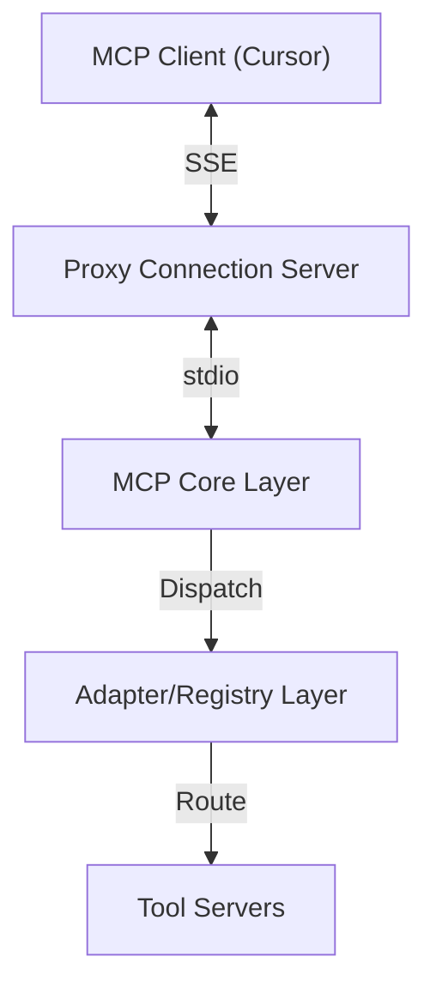

# MCP Architecture Integration Guide

This document explains how the mymcpserver package integrates with the planned MCP architecture described in the documentation. It provides a guide for developers to understand how the different components work together.

## Architecture Overview

The MCP (Machine Comprehension Platform) consists of several layers as described in the architecture documentation:



## Components and Their Purpose

### 1. mymcpserver (Entry Point)

The `mymcpserver` package serves as the main entry point for the entire MCP system. It provides:

- Central configuration management
- Component initialization based on environment settings
- Support for different transport mechanisms (HTTP, stdio, SSE)
- Proper logging and error handling

### 2. Proxy Connection Server (src/mcp_proxy/)

This component handles the translation between different transport protocols:

- Receives requests from MCP clients via SSE, WebSockets, or HTTP
- Translates these requests to stdio for internal communication
- Returns responses back to clients in the appropriate format

### 3. MCP Core Layer (src/mcp_core/)

The central processing component of the system:

- Handles the business logic of processing MCP requests
- Uses the FastAPI framework for HTTP-based API
- Routes requests to the Adapter/Registry Layer
- Handles proper error responses and logging

### 4. Adapter/Registry Layer (src/mcp_core/adapters/)

This component manages tool registration and routing:

- Maintains a registry of available tools
- Versioning support for tools
- Circuit breaker pattern for fault tolerance
- Routes requests to appropriate tool servers

### 5. Tool Servers (src/tool_servers/)

Tool servers implement the actual functionality:

- Python Tool Server for Python-based tools
- TypeScript Tool Server for TypeScript/JavaScript tools
- Each tool server has its own set of tools with specific implementations

## Integration Points

### Starting the Server

The main entry point is through the `mymcpserver` package, which can be started using:

```bash
# Full mode (starts appropriate components based on transport)
uv run mymcpserver

# Start specific components
uv run mymcpserver --component proxy
uv run mymcpserver --component core

# Use different transport mechanisms
uv run mymcpserver --transport stdio
uv run mymcpserver --transport http
```

For more comprehensive control, use the `run_server.py` script:

```bash
# Full system
python src/run_server.py --mode full

# Specific components
python src/run_server.py --mode proxy --transport sse
python src/run_server.py --mode core --transport http
python src/run_server.py --mode tool --tool-server python
```

### Configuration

All components use the same configuration system, which reads from:

1. Environment variables
2. `.env` file
3. Command-line arguments
4. Default values

The configuration system supports different environments (development, production) and component-specific settings.

### Data Flow

1. **Client Request**: The MCP client (Cursor) sends a request
2. **Proxy Server**: Receives the request and translates to the appropriate format
3. **Core Layer**: Processes the request and routes it to the Adapter/Registry
4. **Adapter Layer**: Identifies and routes to the appropriate tool server
5. **Tool Server**: Executes the requested functionality
6. **Response Path**: The response follows the reverse path back to the client

## Cursor Integration

The MCP Server integrates with Cursor through the configuration in `.cursor/mcp.json`, which specifies:

- Command to start the server (`uv run mymcpserver`)
- Environment variables for server configuration
- Transport mechanism (stdio)
- Request/response size limits

## Development Workflow

1. **Setup Environment**:

   ```bash
   # Install dependencies
   uv sync
   ```

2. **Run the Server**:

   ```bash
   # Development mode
   uv run mymcpserver --transport stdio
   ```

3. **Testing**:

   ```bash
   # Run tests
   uv run -m pytest tests/
   ```

4. **Building**:
   ```bash
   # Create distribution package
   uv build
   ```

## Next Steps for Implementation

To complete the integration with the planned architecture:

1. **Implement Tool Servers**: Create and integrate the Python and TypeScript tool servers
2. **Enhance Proxy Server**: Complete the implementation of SSE and WebSocket transports
3. **Improve Adapter Layer**: Add more robust circuit breaker and versioning functionality
4. **Add Health Monitoring**: Implement comprehensive health checks across all components
5. **Create Metrics System**: Add detailed metrics collection and reporting

## Troubleshooting

- **Component Communication**: Check that the transport mechanism is configured correctly
- **Environment Variables**: Verify that all required variables are set in the `.env` file
- **Path Issues**: Ensure that the Python path includes the `src` directory
- **Permissions**: Check file and network access permissions

## Additional Resources

- See `docs-obsidian/user added for indexing later/mcpPlanning/final/filetree.md` for detailed file structure
- See `docs-obsidian/user added for indexing later/mcpPlanning/final/overview.md` for architectural overview
