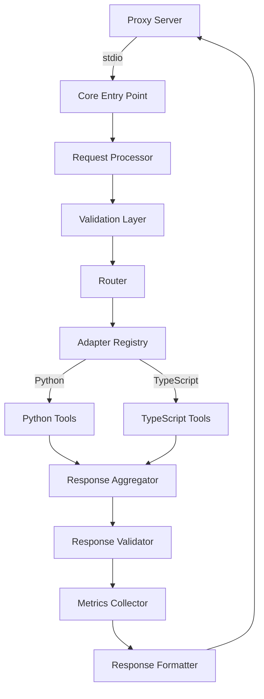

# MCP Core Layer Overview

## Introduction

The MCP Core Layer serves as the central nervous system of our microservices architecture. It orchestrates the flow of requests between the Proxy Connection Server and various tool servers through the enhanced Adapter/Registry Layer. This document provides a comprehensive overview of its enhanced capabilities, architecture, and integration points.

---

## Core Responsibilities

### 1. Request Processing and Validation

- **Protocol Handling:**

  - Receives stdio-formatted requests from the Proxy Connection Server
  - Validates request structure and content against defined schemas
  - Ensures all required metadata is present

- **Request Enrichment:**
  - Adds correlation IDs for request tracking
  - Injects context information for observability
  - Appends version information when needed

### 2. Intelligent Routing

- **Dynamic Dispatch:**

  - Routes requests to appropriate tool servers via the enhanced Adapter/Registry Layer
  - Supports version-aware routing for different tool implementations
  - Handles fallback scenarios when primary routes fail

- **Load Distribution:**
  - Implements intelligent load balancing across tool server instances
  - Respects circuit breaker states during routing decisions
  - Considers server health metrics in routing choices

### 3. Response Management

- **Aggregation and Transformation:**

  - Collects responses from tool servers
  - Transforms responses into standardized formats
  - Handles partial failures gracefully

- **Quality Assurance:**
  - Validates response integrity
  - Ensures response format consistency
  - Manages timeouts and partial responses

### 4. Observability

- **Metrics Collection:**

  - Tracks request/response latencies
  - Monitors error rates and types
  - Captures system health metrics

- **Logging and Tracing:**
  - Implements structured logging
  - Maintains distributed tracing
  - Records system events for debugging

---

## Enhanced Architecture

### Component Overview



### Key Components

1. **Core Entry Point (`app.py`):**

   - Application bootstrap and initialization
   - Configuration loading
   - Service health management

2. **Request Processor:**

   - Request parsing and normalization
   - Context injection
   - Correlation ID management

3. **Validation Layer:**

   - Schema validation
   - Content verification
   - Type checking

4. **Router:**

   - Request routing logic
   - Load balancing
   - Circuit breaker integration

5. **Response Management:**

   - Response collection
   - Format standardization
   - Error handling

6. **Metrics and Monitoring:**
   - Performance metrics
   - Health checks
   - System telemetry

---

## Integration Points

### 1. Proxy Connection Server

- **Input Interface:**

  - Receives stdio-formatted requests
  - Handles protocol conversion
  - Manages connection lifecycle

- **Output Interface:**
  - Returns standardized responses
  - Handles error conditions
  - Maintains connection state

### 2. Enhanced Adapter/Registry Layer

- **Service Discovery:**

  - Dynamic tool server registration
  - Health status monitoring
  - Version management

- **Request Routing:**
  - Intelligent routing decisions
  - Circuit breaker integration
  - Load balancing

### 3. Tool Servers

- **Python Tools:**

  - Direct SDK integration
  - Native type handling
  - Optimized communication

- **TypeScript Tools:**
  - REST/RPC communication
  - Protocol adaptation
  - Type conversion

---

## Configuration Management

### 1. Environment Configuration

- **Runtime Settings:**

  ```python
  CORE_PORT=5000
  LOG_LEVEL=INFO
  METRICS_ENABLED=true
  ```

- **Feature Flags:**
  ```python
  ENABLE_CIRCUIT_BREAKER=true
  ENABLE_METRICS=true
  ENABLE_TRACING=true
  ```

### 2. Dynamic Configuration

- **Hot Reloading:**

  - Configuration updates without restart
  - Feature flag toggling
  - Logging level adjustment

- **Service Discovery:**
  - Automatic tool server detection
  - Dynamic endpoint updates
  - Health check configuration

---

## Error Handling

### 1. Error Categories

- **Client Errors:**

  - Invalid request format
  - Missing required fields
  - Version mismatch

- **System Errors:**
  - Service unavailable
  - Timeout
  - Circuit breaker open

### 2. Recovery Strategies

- **Retry Logic:**

  - Exponential backoff
  - Jitter implementation
  - Maximum retry limits

- **Fallback Mechanisms:**
  - Alternative service routes
  - Cached responses
  - Graceful degradation

---

## Monitoring and Metrics

### 1. Key Metrics

- **Performance:**

  - Request latency
  - Throughput
  - Error rates

- **System Health:**
  - Memory usage
  - CPU utilization
  - Connection pool status

### 2. Alerting

- **Thresholds:**

  - Error rate spikes
  - Latency increases
  - Resource exhaustion

- **Notifications:**
  - Alert routing
  - Severity levels
  - On-call integration

---

## Future Enhancements

1. **Advanced Routing:**

   - AI-powered request routing
   - Predictive load balancing
   - Smart caching strategies

2. **Enhanced Observability:**

   - OpenTelemetry integration
   - Custom metric exporters
   - Advanced tracing capabilities

3. **Resilience Features:**

   - Advanced circuit breaking
   - Chaos engineering support
   - Automated failover

4. **Performance Optimization:**
   - Request batching
   - Response streaming
   - Connection pooling

---

This overview provides a comprehensive understanding of the enhanced MCP Core Layer. For technical implementation details, please refer to the accompanying technical documentation.
