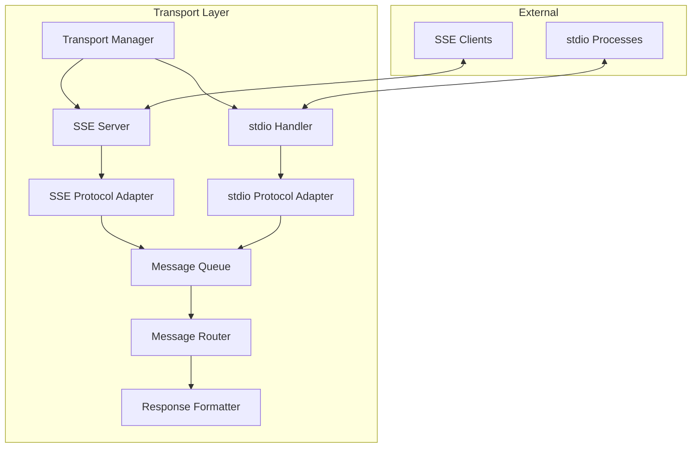
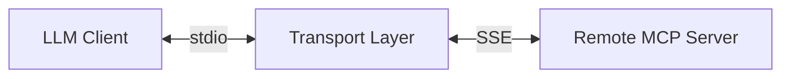

# Transport Layer Overview

## Introduction

The Transport Layer serves as a critical bridge in our MCP architecture, enabling seamless communication between different protocol implementations. It provides bidirectional protocol conversion between Server-Sent Events (SSE) and stdio, allowing for flexible deployment scenarios and client compatibility.

---

## Core Capabilities

### 1. Protocol Conversion

- **SSE to stdio:**

  - Converts incoming SSE events to stdio format
  - Maintains connection state and event ordering
  - Handles SSE reconnection logic

- **stdio to SSE:**
  - Transforms stdio streams into SSE events
  - Manages event delivery and backpressure
  - Supports SSE connection lifecycle

### 2. Connection Management

- **SSE Server:**

  - Configurable host and port binding
  - CORS support for web clients
  - Connection pooling and lifecycle management

- **stdio Handling:**
  - Process spawning and management
  - Environment variable passthrough
  - Command-line argument handling

### 3. Security Features

- **Authentication:**

  - Header-based authentication
  - Token management
  - Environment-based credentials

- **Access Control:**
  - Origin restrictions
  - Connection validation
  - Request filtering

### 4. Reliability Features

- **Connection Recovery:**

  - Automatic reconnection
  - State preservation
  - Error recovery

- **Error Handling:**
  - Protocol-specific error mapping
  - Graceful degradation
  - Error propagation

---

## Architecture

### Component Overview



### Key Components

1. **Transport Manager:**

   - Configuration management
   - Component lifecycle
   - Resource allocation

2. **Protocol Adapters:**

   - Message format conversion
   - Protocol-specific handling
   - Error mapping

3. **Message Router:**

   - Request/response matching
   - Load balancing
   - Circuit breaking

4. **Connection Handlers:**
   - Connection pooling
   - State management
   - Resource cleanup

---

## Deployment Scenarios

### 1. SSE Client Mode



- **Use Case:** Connect local stdio clients to remote SSE servers
- **Example:** Claude Desktop connecting to remote MCP servers

### 2. SSE Server Mode


- **Use Case:** Expose local stdio servers via SSE
- **Example:** Running local tool servers with web access

---

## Configuration

### Environment Settings

```bash
# Server Configuration
TRANSPORT_SSE_PORT=8080
TRANSPORT_SSE_HOST=0.0.0.0
TRANSPORT_LOG_LEVEL=INFO

# Security Settings
TRANSPORT_ALLOW_ORIGINS=*
API_ACCESS_TOKEN=your-token

# Process Settings
TRANSPORT_PASS_ENV=true
```

### Runtime Options

```bash
# SSE Server Mode
mcp-proxy --sse-port 8080 --sse-host 0.0.0.0 your-command

# SSE Client Mode
mcp-proxy http://localhost:8080/sse
```

---

## Integration Points

### 1. Client Integration

- **SSE Clients:**

  - Web browsers
  - HTTP clients
  - Custom SSE implementations

- **stdio Clients:**
  - Command-line tools
  - Language SDKs
  - System processes

### 2. Server Integration

- **MCP Servers:**

  - Python implementations
  - TypeScript implementations
  - Custom server implementations

- **Protocol Support:**
  - SSE endpoints
  - stdio communication
  - Future protocols (WebSocket, gRPC)

---

## Error Handling

### Error Categories

1. **Connection Errors:**

   - Connection timeout
   - Connection refused
   - Network unreachable

2. **Protocol Errors:**

   - Invalid message format
   - Protocol violation
   - Version mismatch

3. **Process Errors:**
   - Process crash
   - Resource exhaustion
   - Permission denied

### Recovery Strategies

1. **Connection Recovery:**

   - Automatic reconnection
   - Exponential backoff
   - Circuit breaking

2. **Error Propagation:**
   - Error translation
   - Context preservation
   - Logging and monitoring

---

## Monitoring

### Key Metrics

1. **Connection Metrics:**

   - Active connections
   - Connection duration
   - Reconnection attempts

2. **Performance Metrics:**

   - Message throughput
   - Processing latency
   - Queue depth

3. **Error Metrics:**
   - Error rates
   - Error types
   - Recovery success rate

### Health Checks

1. **Component Health:**

   - SSE server status
   - Process manager status
   - Queue health

2. **Connection Health:**
   - Connection state
   - Protocol status
   - Resource utilization

---

## Future Enhancements

1. **Protocol Support:**

   - WebSocket transport
   - gRPC integration
   - Custom protocols

2. **Performance Optimization:**

   - Message batching
   - Connection pooling
   - Resource caching

3. **Security Features:**

   - TLS support
   - Authentication plugins
   - Access control lists

4. **Monitoring Enhancements:**
   - Prometheus integration
   - Tracing support
   - Advanced metrics

This overview provides a comprehensive understanding of the Transport Layer's capabilities, architecture, and integration points. For technical implementation details, please refer to the accompanying technical documentation.
