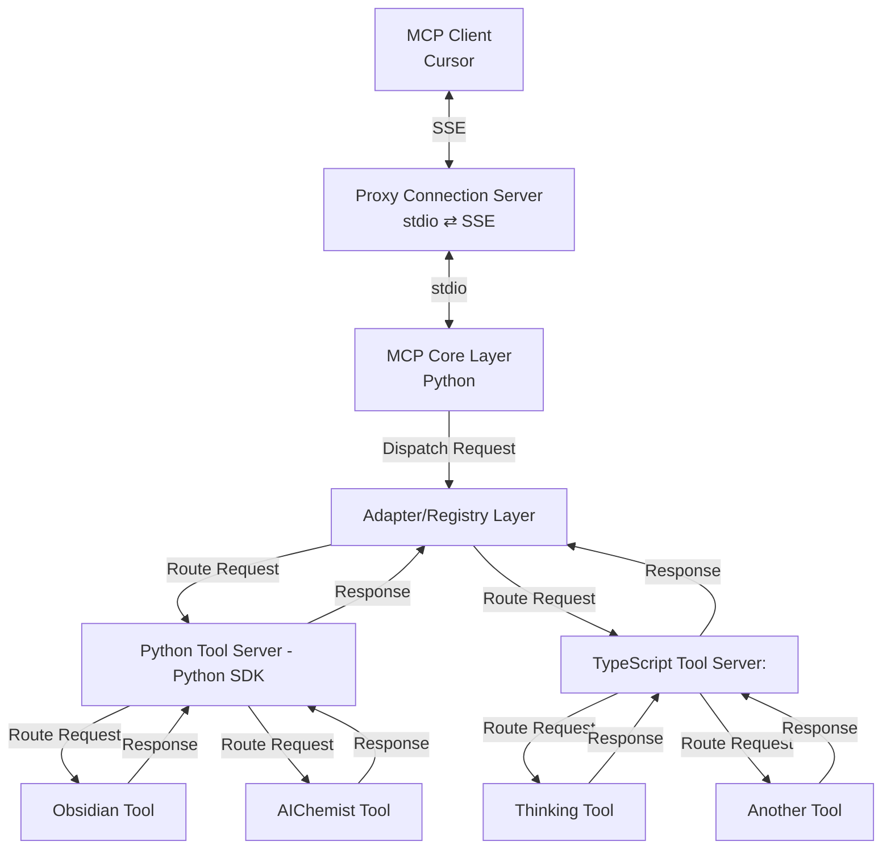

Below is a detailed explanation of each layer in our microservices architecture—directly reflecting the flowchart. This architecture is designed to enable the MCP client (such as Cursor) to seamlessly interact with various tool servers (both Python and TypeScript) through a flexible proxy and core system.

---

## Overview of the Flowchart

Each arrow represents a communication or routing step. Now let’s break down each layer:

---

## 1. MCP Client (Cursor)

**Role:**

- Acts as the external client that initiates MCP requests.
- Typically a desktop or web client (e.g., Cursor) that uses SSE (Server-Sent Events) to communicate with the backend.

**How It Works:**

- The client sends an MCP request over an SSE connection.
- It expects responses through the same SSE channel.

**Importance:**

- Provides the user interface and initial trigger for the entire process.
- Hides the complexity of the underlying system from the end user.

---

## 2. Proxy Connection Server

**Role:**

- Serves as the bridge between different transport protocols.
- Converts between SSE (used by the client) and stdio (used internally).

**How It Works:**

- **Incoming:** Receives SSE messages from the MCP client.
- **Conversion:** Translates these SSE messages into stdio messages.
- **Forwarding:** Passes the converted request to the MCP Core Layer.
- It also performs the reverse when sending responses back to the client.

**Importance:**

- Decouples the external client interface from internal implementation details.
- Enables flexibility if different clients or protocols are used later.

---

## 3. MCP Core Layer (Python)

**Role:**

- Acts as the central processing unit of the system.
- Implements the core MCP logic and handles the dispatching of requests.

**How It Works:**

- **Reception:** Receives stdio-based requests from the Proxy Connection Server.
- **Processing:** Performs any necessary validation or preprocessing of the MCP request.
- **Dispatching:** Forwards the processed request to the Adapter/Registry Layer for further routing.

**Importance:**

- Centralizes business logic so that changes in tool servers or transports require minimal modifications here.
- Simplifies error handling and logging for the overall system.

---

## 4. Adapter/Registry Layer

**Role:**

- Serves as the intermediary that routes MCP requests to the appropriate tool server.
- Provides abstraction so the core system does not need to know the details of each tool implementation.

**How It Works:**

- **Inspection:** Examines the incoming request to determine the type of tool required.
- **Routing:** Decides whether to send the request to the Python Tool Server or the TypeScript Tool Server.
- **Aggregation:** Collects responses from the tool servers, formats them if necessary, and sends them back to the MCP Core Layer.

**Importance:**

- Decouples the MCP core from the specifics of each tool server.
- Provides a plug-and-play mechanism that allows for easy swapping or addition of new tool servers.
- Acts as the central registry for available tools and their submodules.

---

## 5. Python Tool Server (Python SDK)

**Role:**

- Implements tool functionalities using the Python MCP SDK.
- Handles requests for tools developed in Python.

**How It Works:**

- **Entry Point:** Receives routed requests from the Adapter/Registry Layer.
- **Internal Routing:** Forwards the request to specific submodules (n1 or n2).
  - **n1 (Obsidian Tool):** Processes specific operations related to the Obsidian tool.
  - **n2 (AIChemist Tool):** Handles functionality specific to the AIChemist tool.
- **Response:** Gathers the results from the submodules and sends the aggregated response back up to the Adapter/Registry Layer.

**Importance:**

- Provides a dedicated microservice for Python-based tools.
- Isolates tool-specific logic from the core system, making maintenance and development simpler.

---

## 6. TypeScript Tool Server

**Role:**

- Implements tool functionalities using a TypeScript-based approach (via REST or RPC).
- Handles requests for tools developed in TypeScript.

**How It Works:**

- **Entry Point:** Receives routed requests from the Adapter/Registry Layer.
- **Internal Routing:** Forwards the request to its specific submodules (n3 or n4).
  - **n3 (Thinking Tool):** Processes operations for the Thinking tool.
  - **n4 (Another Tool):** Handles functionality for an additional tool.
- **Response:** Collects responses from the submodules and sends them back to the Adapter/Registry Layer.

**Importance:**

- Enables integration of tool servers built with different technology stacks.
- Maintains consistency in how external tool functionalities are invoked and aggregated, despite being implemented in TypeScript.

---

## 7. Submodules (n1, n2, n3, n4)

**Role:**

- Represent the individual tools that perform the specific business logic.
- Are housed within their respective tool server (Python or TypeScript).

**How They Work:**

- **n1 & n2 (under Python Tool Server):**
  - **n1 (Obsidian Tool):** Implements the functionality for one set of operations.
  - **n2 (AIChemist Tool):** Implements a different tool's functionality.
- **n3 & n4 (under TypeScript Tool Server):**
  - **n3 (Thinking Tool):** Implements the core logic for this tool.
  - **n4 (Another Tool):** Implements additional operations.
- Each submodule processes its part of the MCP request, performs computations or data manipulations, and returns a response to its parent tool server.

**Importance:**

- Allow the system to be extensible and modular.
- Make it simple to add new tools or update existing ones without impacting other parts of the system.

---

## Data and Response Flow Summary

1. **Client Interaction:**

   - The MCP Client (Cursor) sends an MCP request over SSE to the Proxy Connection Server.

2. **Transport Conversion:**

   - The Proxy translates SSE to stdio and forwards the request to the MCP Core Layer.

3. **Core Dispatching:**

   - The MCP Core processes and dispatches the request to the Adapter/Registry Layer.

4. **Routing to Tool Servers:**

   - The Adapter/Registry Layer determines the appropriate tool server (Python or TypeScript) and routes the request.
   - Within each tool server, further routing directs the request to specific submodules (n1/n2 or n3/n4).

5. **Response Aggregation:**

   - Each submodule processes the request and sends its response back to its parent tool server.
   - The tool server returns its aggregated response to the Adapter/Registry Layer.
   - The Adapter/Registry Layer aggregates responses from different tool servers if needed, then forwards the result to the MCP Core Layer.

6. **Final Response:**
   - The MCP Core sends the final, formatted response back through the Proxy Connection Server.
   - The Proxy converts the response back to SSE format and delivers it to the MCP Client.

---

## Conclusion

This layered architecture ensures that:

- **Separation of Concerns:** Each layer handles a distinct responsibility (transport conversion, core logic, routing, tool-specific processing).
- **Modularity and Extensibility:** New tool servers or submodules can be added without affecting the core or proxy layers.
- **Technology Agnosticism:** By supporting both Python and TypeScript tool servers, the system can integrate diverse technologies seamlessly.
- **Flexibility in Deployment:** With a design that works for both containerized (Docker) and non-containerized environments, you have the freedom to choose your preferred development and deployment workflow.

This comprehensive explanation should give you a clear understanding of how each layer operates and interacts within our system. Let me know if you need further clarification or additional details!
