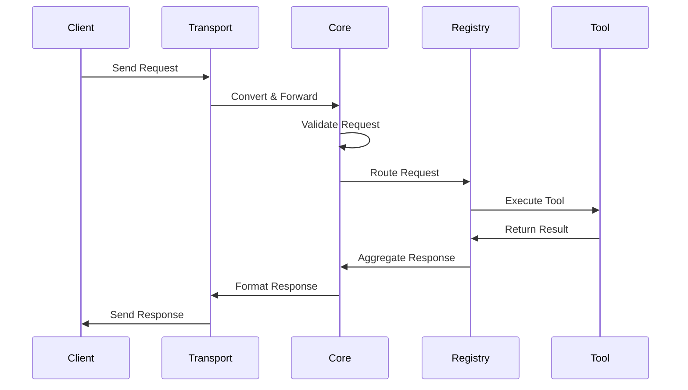
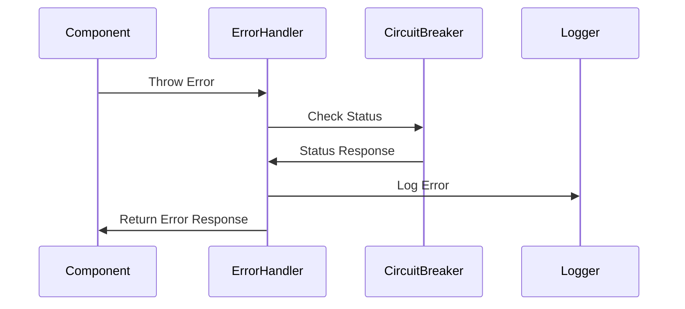

# Component Design

## Component Architecture

### Transport Layer Components

#### Transport Manager

- **Purpose**: Manages transport protocol lifecycle and connections
- **Responsibilities**:
  - Connection initialization and teardown
  - Protocol state management
  - Error recovery
- **Implementation**: `src/mcp_proxy/transports/base_transport.py`

#### Protocol Adapters

- **Purpose**: Convert between different transport protocols
- **Implementations**:
  - SSE Adapter: `src/mcp_proxy/transports/sse.py`
  - stdio Adapter: `src/mcp_proxy/transports/stdio.py`
  - WebSocket Adapter: `src/mcp_proxy/transports/websocket.py`
- **Design Pattern**: Adapter Pattern

### Core Layer Components

#### Request Validator

- **Purpose**: Ensures request validity and format
- **Responsibilities**:
  - Schema validation
  - Type checking
  - Parameter validation
- **Implementation**: `src/mcp_core/validation/validators.py`

#### Metrics Collector

- **Purpose**: Gathers system performance metrics
- **Components**:
  - Collectors: `src/mcp_core/metrics/collectors.py`
  - Exporters: `src/mcp_core/metrics/exporters.py`
- **Metrics Types**:
  - Request latency
  - Error rates
  - Tool usage statistics

#### Config Manager

- **Purpose**: Centralizes configuration management
- **Features**:
  - Environment variable support
  - Configuration file parsing
  - Default value management
- **Implementation**: `src/mcp_core/config/config.py`

### Registry Layer Components

#### Version Manager

- **Purpose**: Handles tool versioning and compatibility
- **Features**:
  - Version tracking
  - Compatibility checking
  - Update management
- **Implementation**: `src/mcp_core/adapters/version.py`

#### Circuit Breaker

- **Purpose**: Prevents cascading failures
- **States**:
  - Closed (normal operation)
  - Open (failure mode)
  - Half-open (recovery)
- **Implementation**: `src/mcp_core/adapters/circuit_breaker.py`
- **Design Pattern**: Circuit Breaker Pattern

#### Health Monitor

- **Purpose**: Tracks system and component health
- **Checks**:
  - Component status
  - Resource usage
  - Dependency health
- **Implementation**: `src/mcp_core/health.py`

### Tool Server Components

#### Python Tool Server

- **Purpose**: Hosts Python-based tools
- **Components**:
  - Server Core: `src/tool_servers/python_tool_server/server.py`
  - Health Checks: `src/tool_servers/python_tool_server/health.py`
  - Hot Reload: `src/tool_servers/python_tool_server/hot_reload.py`

#### TypeScript Tool Server

- **Purpose**: Hosts TypeScript-based tools
- **Components**:
  - Server Core: `src/tool_servers/typescript_tool_server/src/index.ts`
  - Health Checks: `src/tool_servers/typescript_tool_server/src/health.ts`
  - Hot Reload: `src/tool_servers/typescript_tool_server/src/hot-reload.ts`

## Component Interactions

### Request Flow

### Error Handling Flow

## Design Patterns

### 1. Adapter Pattern

- **Usage**: Protocol conversion in Transport Layer
- **Benefits**:
  - Decouples transport protocols
  - Enables easy protocol additions

### 2. Circuit Breaker Pattern

- **Usage**: Failure prevention in Registry Layer
- **Benefits**:
  - Prevents cascading failures
  - Enables graceful degradation

### 3. Observer Pattern

- **Usage**: Health monitoring and metrics
- **Benefits**:
  - Decoupled monitoring
  - Real-time updates

### 4. Factory Pattern

- **Usage**: Tool server instantiation
- **Benefits**:
  - Encapsulated creation logic
  - Consistent initialization

## Implementation Guidelines

### 1. Error Handling

- Use structured error types
- Implement proper error propagation
- Include context in error messages
- Log errors appropriately

### 2. Configuration

- Use environment variables for deployment settings
- Maintain configuration files for defaults
- Validate configurations at startup
- Document all configuration options

### 3. Logging

- Use structured logging format
- Include relevant context
- Implement proper log levels
- Configure log rotation

### 4. Testing

- Unit test individual components
- Integration test component interactions
- Load test under stress conditions
- Monitor performance metrics

## Related Documentation

### Architecture

- [[System Overview]] - High-level system architecture
- [[logging-centralization]] - Logging system design

### Implementation

- [[../mcpPlanning/final/core/technical-v2|Core Technical Details]]
- [[../mcpPlanning/final/adapter/technical-v2|Adapter Technical Details]]
- [[../mcpPlanning/final/transport/technical-v2|Transport Technical Details]]

### MCP Knowledge

- [[../../../mcpKnowledge/core/MCP Server Architecture|MCP Architecture]]
- [[../../../mcpKnowledge/core/Tool Management|Tool Management]]

---

[[../Project MOC|← Back to Project MOC]]
