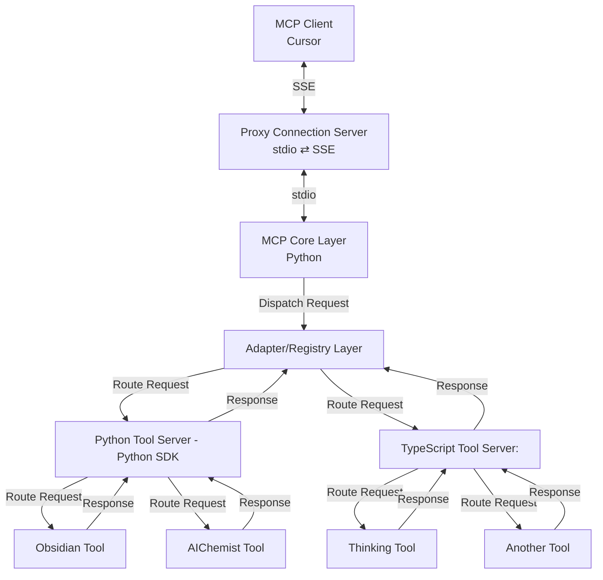

# MCP Microservices Architecture Overview

## Architecture Overview

The MCP (Machine Comprehension Platform) is designed as a modular, extensible system that connects AI clients with specialized tool servers using a layered architecture approach. This architecture enables seamless communication between different components while maintaining separation of concerns.

## System Components

### 1. MCP Client (Cursor)

**Role:**

- External client that initiates MCP requests
- Communicates with the backend via SSE (Server-Sent Events)

**How It Works:**

- Sends structured MCP requests over an SSE connection
- Receives responses through the same SSE channel
- Provides user interface for interacting with MCP tools

### 2. Proxy Connection Server

**Role:**

- Bridges different transport protocols
- Converts between SSE (client-facing) and stdio (internal)

**How It Works:**

- Receives SSE messages from the MCP client
- Translates these messages into stdio format
- Forwards converted requests to the MCP Core Layer
- Performs reverse conversion for responses
- Implements health checks and monitoring endpoints

**Key Features:**

- Protocol adaptation
- Connection management
- Error handling with structured logging
- Health status reporting

### 3. MCP Core Layer (Python)

**Role:**

- Central processing unit of the system
- Handles core business logic and request dispatching

**How It Works:**

- Receives stdio-based requests from the Proxy Connection Server
- Validates and processes incoming MCP requests
- Forwards requests to the Adapter/Registry Layer
- Manages global error handling and logging
- Centralizes configuration management

**Key Features:**

- Centralized configuration system
- Structured error handling
- Comprehensive logging
- Performance monitoring

### 4. Adapter/Registry Layer

**Role:**

- Routes MCP requests to appropriate tool servers
- Provides abstraction for tool implementation details
- Manages tool registration and discovery

**How It Works:**

- Examines incoming requests to determine required tools
- Routes requests to either Python or TypeScript tool servers
- Aggregates responses and formats them for the core layer
- Manages tool server health and connection status

**Key Features:**

- Dynamic tool registration
- Request routing logic
- Response aggregation
- Error handling for failed tool requests

### 5. Tool Servers

#### Python Tool Server (Python SDK)

**Role:**

- Implements Python-based tool functionalities
- Houses specialized tools (Obsidian Tool, AIChemist Tool)

**How It Works:**

- Receives routed requests from the Adapter/Registry Layer
- Forwards requests to specific tool implementations
- Gathers results and sends responses back to Adapter Layer

#### TypeScript Tool Server

**Role:**

- Implements TypeScript-based tool functionalities
- Houses specialized tools (Thinking Tool, Another Tool)

**How It Works:**

- Receives requests via REST/RPC from the Adapter Layer
- Routes requests to individual TypeScript tool implementations
- Returns formatted responses to the Adapter Layer

### 6. Individual Tools (n1, n2, n3, n4)

**Role:**

- Implement specific business logic for various operations
- Process specialized parts of MCP requests

**Examples:**

- **Obsidian Tool (n1)**: Manages Obsidian-related operations
- **AIChemist Tool (n2)**: Handles chemistry-related AI functions
- **Thinking Tool (n3)**: Implements reasoning operations
- **Another Tool (n4)**: Additional specialized functionality

## Cross-Cutting Concerns

### Configuration Management

A unified configuration system that:

- Loads from environment variables
- Supports config files
- Provides sensible defaults
- Makes configuration accessible to all components

### Error Handling

A standardized error handling framework that:

- Defines consistent error types across all layers
- Provides formatted error responses
- Includes relevant contextual information
- Supports proper error propagation

### Logging and Monitoring

A structured logging system that:

- Outputs machine-parsable JSON logs
- Includes contextual metadata
- Supports different log levels
- Enables effective debugging and monitoring

### Health Checks

Health monitoring endpoints that:

- Report service status and uptime
- Check dependency health
- Support system monitoring
- Enable automated health verification

## Data Flow

1. **Client Request**:

   - MCP Client sends request via SSE to Proxy Connection Server

2. **Protocol Conversion**:

   - Proxy converts SSE request to stdio format
   - Forwards to MCP Core Layer

3. **Request Processing**:

   - Core Layer validates and processes request
   - Dispatches to Adapter/Registry Layer

4. **Tool Routing**:

   - Adapter determines appropriate tool server
   - Routes request to Python or TypeScript server

5. **Tool Execution**:

   - Tool server processes request with specific tool(s)
   - Executes business logic and generates results

6. **Response Aggregation**:

   - Results flow back through tool servers to Adapter Layer
   - Adapter aggregates responses if needed

7. **Response Delivery**:
   - Core Layer receives final response
   - Proxy converts response to SSE format
   - Client receives formatted response

## Implementation Benefits

This architecture provides:

- **Modularity**: Independent components can be developed separately
- **Extensibility**: New tools can be added without changing core components
- **Protocol Independence**: Transport protocols can be changed without affecting business logic
- **Technology Flexibility**: Supports both Python and TypeScript implementations
- **Observability**: Built-in monitoring, logging, and health checks
- **Resilience**: Robust error handling and recovery mechanisms
- **Scalability**: Components can be scaled independently based on demand
