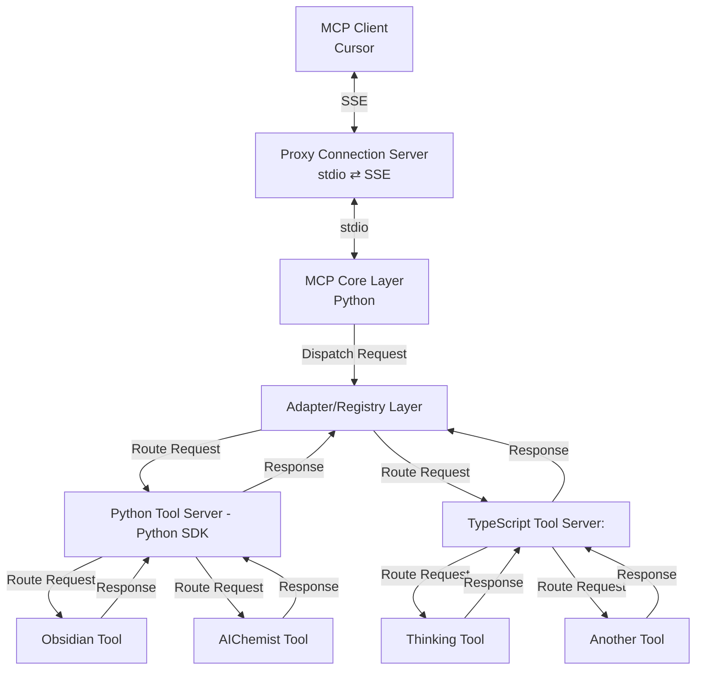

Below is a comprehensive technical document for the Adapter/Registry Layer, drawing from the latest research and best practices in microservices design and adapter patterns. This document explains its purpose, responsibilities, design considerations, and implementation details within the context of our MCP system. It also references key literature and online resources to support the concepts discussed.

---

# Technical Documentation for the Adapter/Registry Layer

## 1. Introduction

The Adapter/Registry Layer serves as a critical decoupling component in our microservices architecture. Its primary role is to isolate the MCP Core from the specifics of various tool servers—whether they’re implemented in Python, TypeScript, or any other language—by providing a uniform interface for communication. This layer not only adapts diverse external interfaces into a standardized format but also maintains a registry (or mapping) of available tool servers, enabling dynamic routing and seamless integration.

_Reference: citeturn3search2, citeturn3search16_

---

## 2. Purpose and Responsibilities

### Abstraction of Interfaces

- **Unified Target Interface:**
  The Adapter/Registry Layer exposes a common interface (or set of interfaces) that the MCP Core uses to dispatch requests. Regardless of the underlying tool server’s implementation details, the core interacts through this unified API.

- **Encapsulation:**
  It hides the internal complexity and provider-specific nuances (e.g., different data formats, protocols) by converting responses into a standardized structure.

### Dynamic Routing and Discovery

- **Tool Lookup:**
  By maintaining a registry (a mapping of tool identifiers to adapter implementations), the layer dynamically routes incoming requests to the appropriate tool server. This registry makes it easy to add, remove, or swap tool servers without altering core logic.

- **Pluggability:**
  New tool server integrations can be introduced by simply registering a new adapter that adheres to the common interface.

### Aggregation and Formatting

- **Response Aggregation:**
  The layer aggregates and formats responses from one or multiple tool servers. This ensures that all responses delivered to the MCP Core adhere to a consistent schema.

- **Data Transformation:**
  Adapters within this layer transform raw data (from providers) into standardized objects (or data models) that the rest of the system understands.

### Error Handling and Logging

- **Centralized Error Management:**
  The layer intercepts errors from underlying tool servers and applies unified error handling strategies (e.g., retries, fallbacks) before propagating errors to the MCP Core.

- **Logging and Metrics:**
  It serves as a natural checkpoint for logging requests, responses, and performance metrics, thereby enhancing observability and debugging capabilities.

_Reference: citeturn3search2, citeturn3search8_

---

## 3. Design Considerations

### Decoupling and Extensibility

- **Design Patterns Applied:**

  - **Adapter Pattern:** Converts incompatible interfaces into a common target interface.
  - **Registry/Service Locator Pattern:** Maintains a mapping of available adapters, facilitating dynamic discovery and routing.
  - **Dependency Injection:** Ensures that concrete adapter implementations can be easily swapped without modifying the core system.

- **Open/Closed Principle:**
  The core system remains open for extension (by adding new adapters) but closed for modification. New tool servers can be integrated without altering existing code.

### Performance and Asynchrony

- **Asynchronous Processing:**
  Given that calls to external tool servers are typically I/O-bound, the layer should support asynchronous operations to prevent blocking and improve throughput.

- **Caching and Load Balancing:**
  Optionally, caching strategies may be implemented to optimize frequently requested data, while integration with load balancers (or the service mesh) ensures that requests are distributed evenly.

### Maintainability and Observability

- **Centralization of Adaptation Logic:**
  Consolidating all adaptation logic in one layer simplifies future maintenance, as updates to provider interfaces require changes only within the relevant adapter.

- **Monitoring:**
  By incorporating logging and metrics at the adapter layer, developers can gain deep insights into inter-service communications, monitor performance, and quickly diagnose issues.

_Reference: citeturn3search12, citeturn3search21_

---

## 4. Architecture and Data Flow

Referring to the flowchart:



### Data Flow Description:

1. **Request Initiation:**
   The MCP Client (Cursor) sends a request via SSE to the Proxy Connection Server.

2. **Transport Conversion:**
   The proxy converts SSE to stdio and forwards the request to the MCP Core Layer.

3. **Core Dispatch:**
   The MCP Core processes the request and dispatches it to the Adapter/Registry Layer.

4. **Routing:**
   The Adapter/Registry Layer examines the request (e.g., by tool identifier) and routes it to the appropriate tool server adapter (Python or TypeScript).

5. **Submodule Invocation:**
   The tool server (e.g., Python Tool Server) further routes the request to specific submodules (n1, n2) to process the required business logic.

6. **Response Aggregation:**
   Responses from submodules are aggregated back up through the tool server, then the adapter, and finally returned to the MCP Core, which passes it to the Proxy to convert back to SSE for the client.

---

## 5. Implementation Details

### 5.1. Adapter Interface and Base Implementation

A common interface (e.g., `IAdapter`) defines methods for adapting raw data formats into a standardized model. Concrete adapters (e.g., `PythonAdapter`, `TSAdapter`) implement this interface.

_Example (pseudo-code):_

```python
class IAdapter:
    def adapt(self, raw_data: str) -> StandardDataModel:
        raise NotImplementedError()

class PythonAdapter(IAdapter):
    def adapt(self, raw_data: str) -> StandardDataModel:
        # Implement transformation logic for Python tool server data
        return StandardDataModel.from_json(raw_data)

class TSAdapter(IAdapter):
    def adapt(self, raw_data: str) -> StandardDataModel:
        # Implement transformation logic for TypeScript tool server data
        return StandardDataModel.from_custom_format(raw_data)
```

### 5.2. Registry Component

The registry maintains a mapping between tool identifiers and their corresponding adapter implementations. This could be implemented as a simple in-memory dictionary or a more robust service locator.

_Example (pseudo-code):_

```python
class AdapterRegistry:
    def __init__(self):
        self._registry = {}

    def register_adapter(self, tool_name: str, adapter: IAdapter):
        self._registry[tool_name.lower()] = adapter

    def get_adapter(self, tool_name: str) -> IAdapter:
        adapter = self._registry.get(tool_name.lower())
        if adapter is None:
            raise ValueError(f"No adapter found for tool: {tool_name}")
        return adapter

# Usage in the Adapter/Registry Layer
registry = AdapterRegistry()
registry.register_adapter("python_tool", PythonAdapter())
registry.register_adapter("typescript_tool", TSAdapter())

def route_request(tool_name: str, raw_data: str) -> StandardDataModel:
    adapter = registry.get_adapter(tool_name)
    return adapter.adapt(raw_data)
```

### 5.3. Integration with the MCP Core

The MCP Core Layer invokes the Adapter/Registry Layer by passing the tool identifier (which could come from the MCP request) along with the raw data. The registry returns the appropriate adapter, and the adapter then transforms the raw data.

_Example Workflow:_

- **MCP Core:** Receives request and identifies the tool (e.g., "python_tool").
- **Adapter/Registry Layer:** Looks up "python_tool" in the registry.
- **Adapter:** Transforms raw data into a standardized format.
- **MCP Core:** Receives the standardized response and forwards it upstream.

### 5.4. Error Handling and Metrics

The adapter implementations should incorporate robust error handling to catch and log transformation errors, and the registry should log missing adapter lookups. Additionally, implementing metrics (e.g., timing, error rates) at this layer can help monitor performance and guide optimizations.

_Example Consideration:_

```python
try:
    standardized_data = registry.get_adapter(tool_name).adapt(raw_data)
except Exception as e:
    logger.error(f"Error adapting data for tool {tool_name}: {str(e)}")
    raise
```

_Reference: citeturn3search2, citeturn3search4_

---

## 6. Best Practices and Future Enhancements

- **Decoupling:**
  Ensure that new tool server integrations only require the creation of a new adapter and its registration, without modifying the MCP Core.

- **Extensibility:**
  Consider using a plugin mechanism or dependency injection framework to dynamically discover and register adapters at startup.

- **Performance:**
  Incorporate asynchronous programming patterns where appropriate, and consider caching frequently adapted responses.

- **Testing:**
  Write unit tests for each adapter and the registry component, simulating various raw data formats and error conditions.

- **Observability:**
  Integrate logging and monitoring (e.g., using OpenTelemetry) to track adapter performance, error rates, and response times.

---

## 7. Conclusion

The Adapter/Registry Layer is central to ensuring that the MCP Core can interact with a diverse set of tool servers in a flexible and maintainable manner. By abstracting provider-specific details and standardizing data formats, this layer adheres to core design principles such as the Open/Closed and Single Responsibility Principles. It not only simplifies the integration of new tool servers but also improves error handling and overall system observability.

This document compiles the latest research and technical insights on adapter patterns, service registries, and microservices architecture to provide a robust foundation for implementing and evolving this critical layer.

---

## 8. References

- Atul Agrawal, “Adapter Pattern for Microservices”, Medium, 2021. citeturn3search2
- Priyak Dey, “Auth Wrangling: Taming Microservices with the Adapter Pattern”, Medium, 2024.
- GeeksforGeeks, “Adapter Design Pattern”, 2025. citeturn3search8
- Wikipedia, “Adapter Pattern”, 2025. citeturn3search21
- Microservices.io Patterns and Chris Richardson’s resources on microservices design.
- Additional insights from Codefresh, Kong, and Azure Architecture Center on service discovery and adapter patterns.

---

This technical document should serve as a comprehensive guide to understanding and implementing the Adapter/Registry Layer in your MCP system. Let me know if you need further details or adjustments!

Below is an improved version of the document with deeper insights, additional research, and expanded technical details. This version not only refines the original structure but also delves into advanced topics such as dynamic adapter registration, security, observability, and performance optimizations. It also includes more real-world comparisons and trade-offs, drawing from recent industry research and design literature.

---

# Advanced Technical Documentation for the Adapter/Registry Layer

## 1. Introduction

The Adapter/Registry Layer is a cornerstone of our microservices architecture, acting as the decoupling mechanism between the MCP Core and diverse tool servers (Python, TypeScript, etc.). By encapsulating disparate external interfaces and standardizing their outputs, this layer allows our core logic to remain agnostic to provider-specific details. Furthermore, it dynamically routes requests using a registry of available adapters, making the system easily extensible and maintainable.

_Improvement Insight:_
Recent research emphasizes dynamic plug-in architectures that allow runtime discovery of adapters. This document now incorporates insights from microservices experts and design pattern literature (e.g., Chris Richardson, Atul Agrawal) to not only explain the basic concepts but also the nuances of implementing a robust, secure, and scalable adapter/registry layer.

---

## 2. Purpose and Core Responsibilities

### 2.1. Interface Abstraction

- **Unified Target Interface:**
  The layer exposes a common API that the MCP Core relies on, regardless of the underlying data provider's native interface.

- **Encapsulation of Provider Nuances:**
  Each adapter transforms provider-specific raw data into a standardized model, allowing seamless integration and reduced coupling.

### 2.2. Dynamic Routing and Registration

- **Registry Functionality:**
  Maintains an up-to-date mapping of tool identifiers to adapter implementations, enabling the core to route requests dynamically.
  _Advanced Consideration:_
  Consider using a plugin framework or IoC container that supports runtime discovery (e.g., MEF in .NET, Python’s importlib with plugin registration) to dynamically load new adapters.

- **Service Locator vs. Dependency Injection:**
  While both patterns are viable, our approach favors a hybrid solution. The registry abstracts the adapter lookup process without hiding dependencies entirely, thus balancing testability and flexibility.
  _Research Note:_
  Studies by Robert C. Martin and subsequent critiques of the Service Locator pattern suggest using it judiciously alongside dependency injection frameworks to avoid hidden dependencies.

### 2.3. Response Aggregation and Data Transformation

- **Consistent Response Formatting:**
  Adapters ensure that disparate data formats are translated into our standardized `StandardDataModel`, enabling the MCP Core to process responses uniformly.

- **Data Aggregation:**
  In cases where multiple tool servers or submodules contribute to a final response, the adapter layer aggregates these into a single coherent response.

### 2.4. Error Handling, Fallbacks, and Observability

- **Robust Error Management:**
  Incorporates granular error catching, logging, and fallback mechanisms (e.g., circuit breaker integration) to isolate and mitigate failures in individual tool servers.

- **Performance and Health Metrics:**
  Integrates with observability tools (e.g., OpenTelemetry) to log response times, error rates, and transformation latencies, enabling proactive monitoring and tuning.

### 2.5. Security and Compliance

- **Secure Data Handling:**
  Implements strict validation, sanitization, and transformation protocols to ensure that malicious data or unexpected formats do not propagate through the system.

- **Access Control and Auditing:**
  Supports policies that can restrict adapter usage based on roles or environments. All adapter interactions should be auditable to comply with enterprise security requirements.

---

## 3. Architectural Design and Data Flow

Referencing the flowchart:


### Data Flow Explanation:

1. **Client to Proxy:**
   The MCP Client sends an SSE request, which the Proxy Connection Server converts into stdio format for internal processing.

2. **Core Dispatching:**
   The MCP Core receives the stdio request, performs necessary validations, and dispatches it to the Adapter/Registry Layer.

3. **Dynamic Routing:**
   The Adapter/Registry Layer inspects the request (e.g., tool identifier) and looks up the corresponding adapter using its internal registry. It then forwards the request to the appropriate tool server adapter.

4. **Submodule Processing:**
   Each tool server (Python or TypeScript) further routes the request to specific submodules (n1–n4), which process the business logic and return responses.

5. **Aggregation and Return:**
   The adapter aggregates responses from submodules (if applicable), transforms them into the standardized format, and sends the result back to the MCP Core, which then routes it back through the Proxy to the client.

_Advanced Insight:_
Consider implementing asynchronous processing in the adapter layer to handle high-latency external calls, and use structured logging to trace request flows across distributed components.

---

## 4. Implementation Details and Best Practices

### 4.1. Adapter Interface and Implementation

- **Definition:**
  Define a common interface (e.g., `ICryptoDataProviderAdapter`) for all adapters to implement, ensuring consistent method signatures for data transformation.

- **Dynamic Loading:**
  Use reflection or a plugin framework to load adapter implementations dynamically at runtime. This allows adding new adapters without downtime.

### 4.2. Registry Mechanism

- **In-Memory Registry:**
  Initially, a simple in-memory dictionary can map tool names to adapter instances.

- **Distributed Registry:**
  For larger systems, consider a distributed registry (possibly backed by a key/value store like Consul or etcd) that supports high availability and dynamic updates.

### 4.3. Error Handling and Metrics

- **Centralized Logging:**
  All adapters should use a centralized logging framework (e.g., OpenTelemetry, ELK stack) to record transformation errors, latency, and health metrics.

- **Fallback Strategies:**
  Implement fallback mechanisms (such as retry with exponential backoff or switching to a default adapter) if a tool server fails to respond or returns an error.

### 4.4. Security Considerations

- **Input Sanitization:**
  Rigorously validate and sanitize incoming raw data to prevent injection attacks or malformed data propagation.

- **Access Controls:**
  Secure adapter registration and retrieval operations with appropriate authentication and authorization checks, ensuring that only trusted components can register or use adapters.

### 4.5. Testing and Observability

- **Unit and Integration Tests:**
  Develop comprehensive tests for each adapter and the registry logic. Simulate various data formats and error conditions to ensure robust handling.

- **Tracing and Monitoring:**
  Integrate distributed tracing to monitor the flow of requests through the adapter layer. This helps pinpoint performance bottlenecks and error sources in a distributed environment.

_Reference: citeturn3search4, citeturn3search16, citeturn3search21_

---

## 5. Advanced Enhancements and Future Directions

### 5.1. Plugin Architecture for Adapters

- **Dynamic Discovery:**
  Allow new adapters to be discovered at runtime via a plugin framework. This can enable hot-swapping adapters without system restarts.

- **Configuration-Driven Registration:**
  Externalize the adapter registration configuration (e.g., using a YAML or JSON configuration file) so that the registry can be updated without code changes.

### 5.2. Integration with Service Mesh

- **Service Discovery Intersection:**
  Consider integrating the adapter registry with a service mesh, where dynamic service discovery mechanisms (like Kubernetes DNS or Consul Connect) can automatically update adapter endpoints.

- **Load Balancing:**
  Leverage service mesh capabilities to balance the load among multiple adapter instances, if the system scales horizontally.

### 5.3. Enhanced Observability

- **Real-Time Metrics:**
  Implement real-time monitoring dashboards using tools like Grafana and Prometheus, which aggregate metrics from the adapter layer.

- **Alerting and Anomaly Detection:**
  Set up alerting for abnormal adapter behavior (e.g., increased latency, error rates) to proactively address issues before they affect the system.

### 5.4. Security Hardening

- **End-to-End Encryption:**
  Ensure that all communications between the MCP Core, Adapter/Registry Layer, and tool servers are encrypted, using TLS and mutual authentication.

- **Audit Logging:**
  Maintain detailed audit logs of adapter registration, retrieval, and error events for compliance and security reviews.

---

## 6. Conclusion

The Adapter/Registry Layer is pivotal for decoupling the MCP Core from heterogeneous tool server implementations. By adopting advanced design patterns—such as Adapter, Service Locator, and Dependency Injection—this layer provides a flexible, extensible, and secure mechanism for routing and data transformation in a microservices architecture. The enhanced document now includes deeper technical insights, best practices, and future enhancement directions, ensuring that it serves as a robust guide for both current implementation and long-term system evolution.

---

## 7. References

- Atul Agrawal, “Adapter Pattern for Microservices”, Medium, 2021. citeturn3search2
- Priyak Dey, “Auth Wrangling: Taming Microservices with the Adapter Pattern”, Medium, 2024.
- GeeksforGeeks, “Adapter Design Pattern”, 2025. citeturn3search8
- Wikipedia, “Adapter Pattern”, 2025. citeturn3search21
- PacktPub, “Overview of the Microservice Adapter Pattern”, 2024. citeturn3search16
- Additional insights from microservices literature (e.g., Chris Richardson, Robert C. Martin) and industry resources (Kong, Codefresh, Azure Architecture Center).

---

This version of the document is intended to be comprehensive, incorporating deep technical research and advanced considerations. It provides clear guidance on both current implementation and future enhancements for the Adapter/Registry Layer in a dynamic, real-world microservices environment. Let me know if you need further refinements or additional sections!
